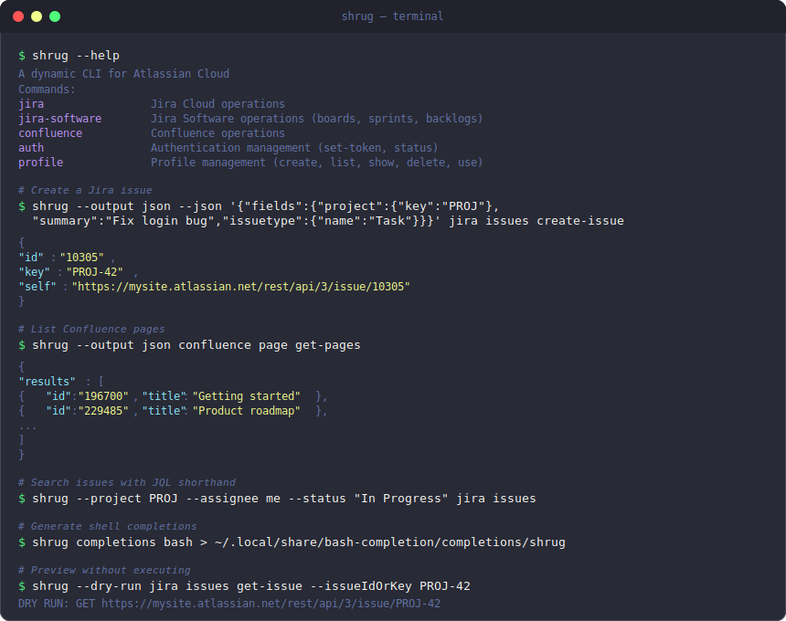

<p align="center">
  
</p>

<h1 align="center">shrug</h1>

A dynamic CLI for Atlassian Cloud. Commands are generated at runtime from Atlassian's OpenAPI specifications, so the binary ships with no hardcoded API knowledge and automatically supports every endpoint across Jira, Jira Software, and Confluence (~925 operations).

<p align="center">
  
</p>

## Features

- **Dynamic command generation** from OpenAPI 3.0.1 specs
- **Three Atlassian products** with a single binary: Jira, Jira Software, Confluence
- **Multi-profile authentication** with OS keychain storage, OAuth 2.0 (PKCE), and encrypted file fallback
- **Five output formats**: JSON, table, YAML, CSV, plain text with TTY detection
- **Helper commands**: `+create`, `+search`, `+transition` shortcuts for common Jira workflows
- **JQL shorthand**: `--project`, `--assignee me`, `--status` flags build JQL queries
- **Markdown to ADF**: write issue descriptions and comments in Markdown
- **Shell completions**: bash, zsh, fish, PowerShell with dynamic resource completion
- **Binary spec caching**: rkyv zero-copy deserialisation for <30ms warm startup
- **Cross-platform**: Windows, macOS, Linux

## Installation

### From GitHub Releases (recommended)

Download the latest binary from [GitHub Releases](https://github.com/mfassaie/shrug/releases).

**Linux/macOS (shell installer):**

```sh
curl --proto '=https' --tlsv1.2 -LsSf https://github.com/mfassaie/shrug/releases/latest/download/shrug-installer.sh | sh
```

**Windows (PowerShell installer):**

```powershell
powershell -ExecutionPolicy ByPass -c "irm https://github.com/mfassaie/shrug/releases/latest/download/shrug-installer.ps1 | iex"
```

### From source

```sh
cargo install --git https://github.com/mfassaie/shrug
```

## Quick start

### 1. Create a profile

```sh
shrug profile create --name work --site mysite.atlassian.net --email me@company.com
shrug auth set-token --profile work
```

### 2. Search for issues

```sh
shrug jira +search --project PROJ --assignee me --status "In Progress"
```

### 3. Create an issue

```sh
shrug jira +create --project PROJ --summary "Fix login bug" --issue-type Bug
```

### 4. List Confluence pages

```sh
shrug confluence Page get-pages --output table
```

### 5. Use different output formats

```sh
shrug jira Issues get-issue --issueIdOrKey PROJ-123 --output json
shrug jira Issues get-issue --issueIdOrKey PROJ-123 --output yaml
shrug jira Issues get-issue --issueIdOrKey PROJ-123 --output table --fields key,summary,status
```

## How it works

shrug downloads OpenAPI specifications from Atlassian's CDN and generates a command tree at runtime.

```
shrug jira issues list --project TEST --output table
      │    │      │
      │    │      └── operationId from spec → HTTP method + URL
      │    └────────── tag from spec → command group
      └──────────────── product → which spec to load
```

Tags become command groups. Operation IDs become leaf commands. Parameters become flags. The binary never hardcodes API endpoints, so new Atlassian APIs are available as soon as they appear in the published specs.

Specs are cached locally with rkyv binary serialisation (zero-copy deserialisation in <1ms) and refreshed in the background using ETag-based conditional requests.

## Authentication

shrug supports two authentication methods:

**API token (Basic Auth)** — the simplest option. Generate a token at [id.atlassian.com/manage-profile/security/api-tokens](https://id.atlassian.com/manage-profile/security/api-tokens).

**OAuth 2.0 (3LO with PKCE)** — for automated workflows. Run `shrug auth login` to open a browser flow. Tokens refresh automatically.

Credentials are stored in the OS keychain (macOS Keychain, Windows Credential Manager, Linux Secret Service). An encrypted file fallback is available when the keychain is not accessible.

For CI/CD, set `SHRUG_SITE`, `SHRUG_EMAIL`, and `SHRUG_API_TOKEN` environment variables.

## Supported products

| Product | Command | Spec format | Operations |
|---------|---------|-------------|------------|
| Jira Platform | `shrug jira` | OpenAPI 3.0.1 | ~620 |
| Jira Software | `shrug jira-software` | OpenAPI 3.0.1 | ~95 |
| Confluence | `shrug confluence` | OpenAPI 3.0.1 | ~210 |

## Shell completions

```sh
# Bash
shrug completions bash > ~/.local/share/bash-completion/completions/shrug

# Zsh
shrug completions zsh > ~/.zfunc/_shrug

# Fish
shrug completions fish > ~/.config/fish/completions/shrug.fish

# PowerShell
shrug completions powershell >> $PROFILE
```

## Configuration

shrug uses layered TOML configuration with this precedence:

1. Command-line flags (highest)
2. Environment variables (`SHRUG_*`)
3. Project config (`.shrug.toml` in current directory or git root)
4. User config (`~/.config/shrug/config.toml`)
5. Built-in defaults (lowest)

## Contributing

See [CONTRIBUTING.md](CONTRIBUTING.md) for build instructions and contribution guidelines.

## Licence

[MIT](LICENSE)
